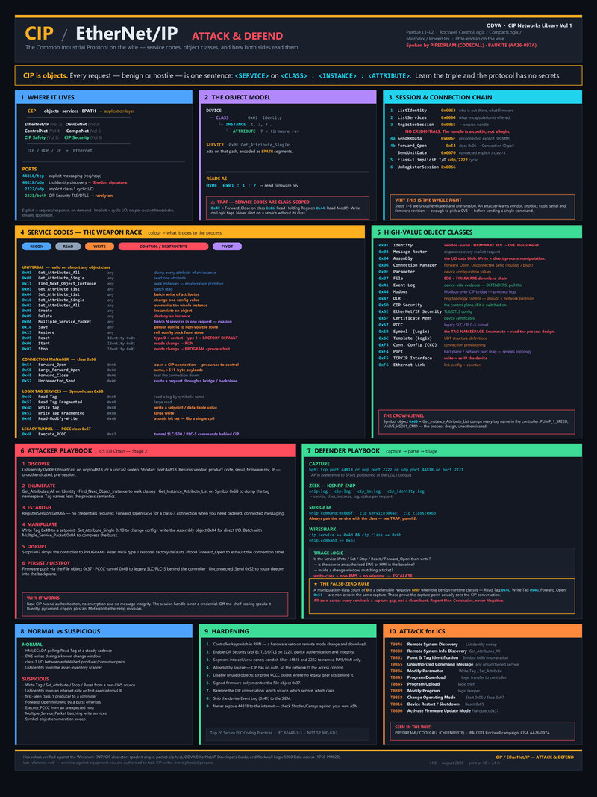
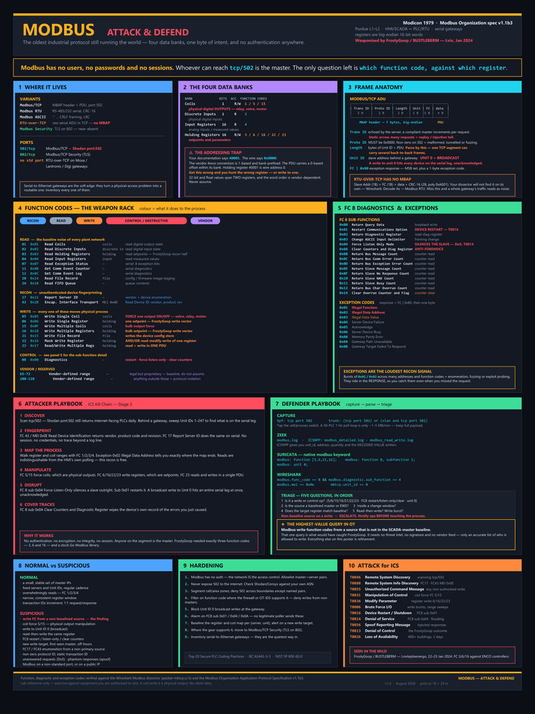
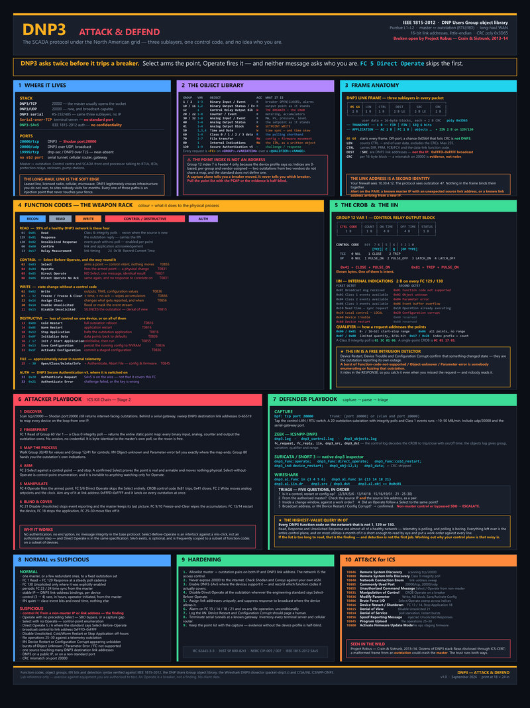

# OT Security One-Pagers

**One protocol. One sheet. Everything you need to attack it, defend it, and not get fooled by it.**

Print-ready single-sheet references for OT/ICS protocols and the tradecraft around them —
built for the analyst mid-hunt, the responder with a packet capture open, and the assessor
standing in a plant with no second monitor and no internet.

  
  &nbsp;&nbsp;
  
  &nbsp;&nbsp;
  
   
  <em>CIP / EtherNet/IP &nbsp;·&nbsp; Modbus &nbsp;·&nbsp; DNP3 — click any for the full-resolution PDF</em>

## The sheets

| Sheet | Protocol | The one idea | Formats | Status |
|---|---|---|---|---|
| [**CIP**](./CIP/) | CIP / EtherNet/IP (ODVA) — service codes, object model, attack & defend | Every request is a `<SERVICE>` called on a `<CLASS>:<INSTANCE>:<ATTRIBUTE>` | [PDF](./CIP/CIP_EtherNetIP_Attack_Defend_Poster.pdf) · [PNG](./CIP/CIP_EtherNetIP_Attack_Defend_Poster.png) · [PPTX](./CIP/CIP_EtherNetIP_Attack_Defend_Poster.pptx) | v1.0 |
| [**Modbus**](./Modbus/) | Modbus TCP / RTU / ASCII (Modicon, 1979) — four data banks, function codes, attack & defend | Four data banks and one byte of intent — no users, no passwords, no sessions | [PDF](./Modbus/Modbus_Attack_Defend_Poster.pdf) · [PNG](./Modbus/Modbus_Attack_Defend_Poster.png) · [PPTX](./Modbus/Modbus_Attack_Defend_Poster.pptx) | v1.0 |
| [**DNP3**](./DNP3/) | DNP3 TCP / UDP / serial (IEEE 1815-2012) — object library, function codes, attack & defend | DNP3 asks twice before it trips a breaker — Select arms the point, Operate fires it, and neither message asks who you are | [PDF](./DNP3/DNP3_Attack_Defend_Poster.pdf) · [PNG](./DNP3/DNP3_Attack_Defend_Poster.png) · [PPTX](./DNP3/DNP3_Attack_Defend_Poster.pptx) | v1.0 |

More protocols land the same way. The layout is deliberately repeatable — read one sheet and
you know where to look on every sheet after it.

## What's on a sheet

Ten panels on the same skeleton, in the same order. Panels 2, 3 and 5 adapt to what the
protocol actually has — CIP gets an object model and a connection chain, Modbus gets four
data banks and a diagnostics sub-function table, DNP3 gets a group/variation object library
and the CROB-plus-IIN pair — but the reading order never moves.

| # | Panel | What you get |
|---|---|---|
| 🎯 | **The one idea** | The single sentence that makes the rest of the protocol decode itself. CIP: *"every request is `<SERVICE>` on `<CLASS>:<INSTANCE>:<ATTRIBUTE>`."* Modbus: *"whoever can reach `tcp/502` is the master — the only question left is which function code, against which register."* DNP3: *"Select arms the point, Operate fires it — and neither message asks who you are."* |
| 1 | **Where it lives** | Spec volumes, variants, encapsulation stack, ports, Purdue level |
| 2 | **The data model** | The structure the protocol addresses — CIP's object model, Modbus's four data banks, DNP3's object library of groups and variations — and how R/W access maps onto physical process |
| 3 | **The wire format** | The frame you actually have to decode, field by field, worked through a real example |
| 4 | **Service / function codes** | The full table, colour-coded by *what it does to the physical process*, not by what the spec calls it |
| 5 | **The high-value targets** | What an attacker goes looking for and why — CIP's high-value objects, Modbus's FC 8 diagnostics and exception codes, DNP3's Control Relay Output Block and the Internal Indications bits that report the outstation's own state |
| 6 | **Attacker playbook** | discover → enumerate → establish → manipulate → disrupt → cover tracks, mapped to the ICS Kill Chain |
| 7 | **Defender playbook** | Copy-pasteable BPF, Zeek, Suricata and Wireshark syntax, plus the triage logic behind them |
| 8 | **Normal vs suspicious** | The baseline — so the sheet works for someone who has never seen the protocol |
| 9–10 | **Hardening + ATT&CK for ICS** | Concrete controls and technique IDs |
| ⚠️ | **Traps** | The specific ways analysts get this protocol wrong, called out in their own panel — CIP's class-scoped service codes and false-zero rule, Modbus's 4xxxx addressing trap and RTU-over-TCP frames that carry no MBAP header, DNP3's vendor-assigned point index that names no breaker without the device profile and the link address that your firewall never sees |

## Formats

| File | Use it for |
|---|---|
| `.pptx` | Editable source of truth — fork it, restyle it, extend it |
| `.pdf` | Vector master for printing |
| `.png` | Screen use — wiki, slide embed, chat |

Laid out for **18 × 24 in at 300 dpi**. Also reads fine on a monitor at 100% zoom,
one panel at a time.

## How people use them

- 🖨️ **Print one** and tape it to the SOC wall or the control-room office door.
- 🔎 **Hunt with it** — the defender panel is written so the filters and detection syntax
  lift straight into a terminal or a rule file.
- 🎓 **Onboard with it** — hand it to an analyst who knows IT but not ICS and it will carry
  them through their first industrial packet capture.
- 🗣️ **Brief with it** — the attacker panel maps onto how an intrusion in that protocol
  actually unfolds, in the order it unfolds.

## Accuracy

Values are checked against primary sources: protocol dissector source code, the published
specification or vendor developers' guide, and vendor programming manuals. Sources are named
in the footer of every sheet — the Wireshark ENIP/CIP dissectors, the ODVA developers guide
and Rockwell's Logix 5000 Data Access manual for CIP; the Wireshark Modbus dissector
(`packet-mbtcp.c`) and the Modbus Organization Application Protocol Specification v1.1b3 for
Modbus; IEEE 1815-2012, the DNP Users Group object library, the Wireshark DNP3 dissector
(`packet-dnp3.c`) and CISA/INL's ICSNPP-DNP3 for DNP3. Where a technique has been seen in the
wild, the malware family, activity group or advisory is cited by name — FrostyGoop /
BUSTLEBERM against ENCO controllers at Lvivteploenergo, January 2024, is on the Modbus sheet
for exactly that reason, and Project Robus (Crain & Sistrunk, 2013–14) is on the DNP3 sheet
for the same one.

Spotted something wrong? **Open an issue with the source to check against, or send a PR.**
Corrections to hex values, service semantics and detection syntax are especially welcome —
so are requests for the next protocol.

## ⚠️ Use responsibly

Lab and reference material. Exercise the offensive content only against equipment you are
authorised to test. OT protocol writes move physical process — a stop command on a production
controller is an outage, a Modbus coil write is a physical output changing state, and a DNP3
Operate is a breaker — not a finding.

## Licence

[**CC BY 4.0**](./LICENSE) — Creative Commons Attribution 4.0 International.

Print them, hand them out, put them in a deck, fork the `.pptx` and build the next protocol
sheet. Commercial use included: take one into a client engagement or a paid training room.
The only condition is credit:

> OT Security One-Pagers — https://github.com/SackOfHacks/OT_Security_OnePagers — CC BY 4.0

If you extend a sheet or restyle it, say what you changed.
